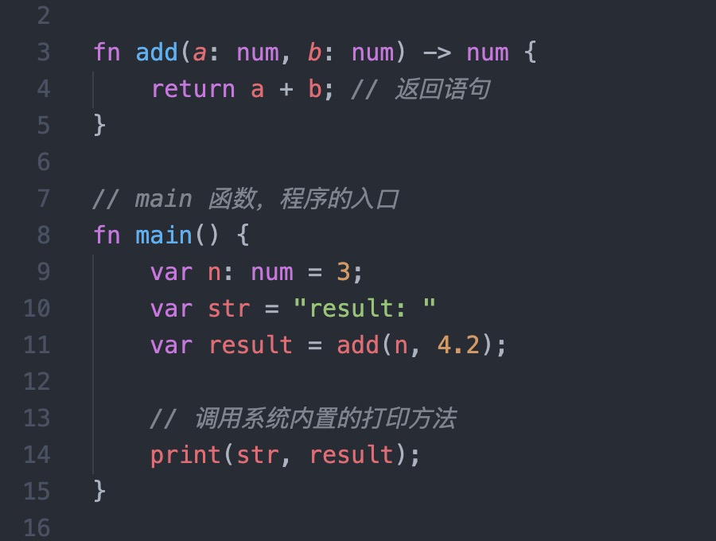

# vscode-x-lang

The `x-lang` language supports for vscode

## 语法高亮

## 开发资源

- [vscode language-extensions doc](https://code.visualstudio.com/api/language-extensions/overview)
- [TextMate Language Grammars](https://macromates.com/manual/en/language_grammars)
- [TextMate Regular Expressions](https://macromates.com/manual/en/regular_expressions)
